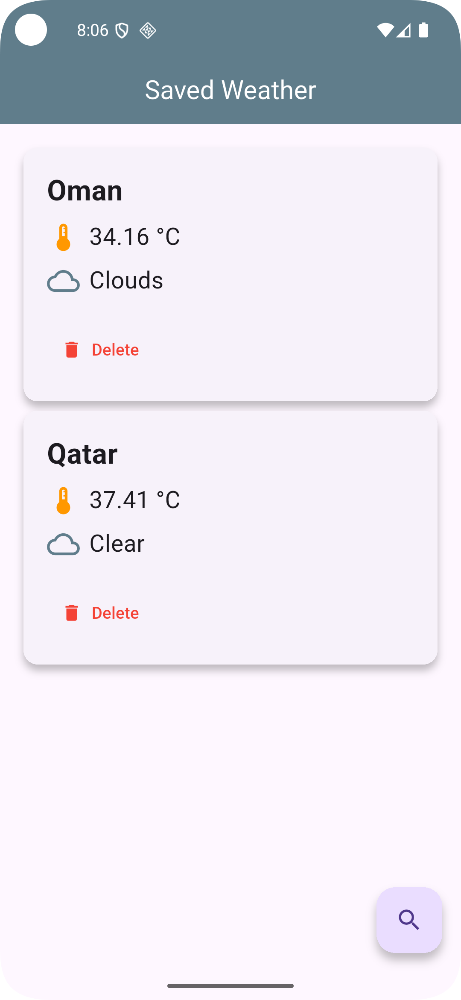

# weatherapptask

A new Flutter project.

---

## Project Structure & Core Components

This project follows the MVVM pattern with Provider state management and uses Dio for API calls.

### Core files and responsibilities:

- **BaseAppClient**  
  Handles all network requests using Dio. It automatically appends the API key and other headers to every request.

- **AuthController**  
  Holds the API key and handles user authentication state (if needed). Currently provides the OpenWeatherMap API key.

- **WeatherViewModel**  
  Acts as the bridge between UI and data.
  - Fetches weather data from the API using `BaseAppClient`.
  - Stores the current weather result (`weatherEntry`).
  - Handles loading and error states.
  - Manages saving and loading weather data locally via SQLite.

- **WeatherEntry Model**  
  Represents the weather data fetched from the API or stored locally.

- **UI Screens**
  - `SearchWeatherScreen`: allows searching weather by city name, showing results, saving locally, and displaying saved weather entries.
  - `WeatherDetailsScreen`: shows detailed weather info for a selected entry.

---

## Adding Images to README
2. Reference the images in this README like so:

